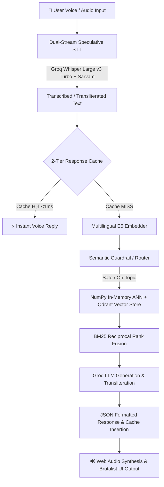

# ⚡ CASA POTENZA — Ultra-Low-Latency Multilingual Voice RAG

[](https://opensource.org/licenses/MIT)
[-10B981)](#-latency-benchmarks--percentile-sla)
[](#-supported-languages--phonetic-transliteration)
[](#-frontend-architecture--ui-features)

**CASA POTENZA** is a real-time, multilingual Voice RAG (Retrieval-Augmented Generation) system engineered for conversational voice AI with sub-millisecond response caching, dual-stream speculative speech recognition, and an interactive Neo-Brutalist frontend interface.

---

## 🎯 Key Highlights

- **⚡ Sub-Millisecond (<1ms) Response Cache:** 2-tier in-memory cache combining exact string hash lookups (<0.01ms) and high-cosine semantic vector matches (<5ms).
- **🎙️ Dual-Stream Speculative STT:** Parallel acoustic decoding preventing cross-Dravidian language drift between Tamil and Telugu in auto-detect mode.
- **🧠 Post-STT Phonetic Disambiguation:** Automatically detects and transliterates Tanglish, Hinglish, and Telugish phonetics into authentic native scripts.
- **🔍 In-Memory Dense Vector Retrieval:** Sub-3ms ANN vector scan across 24,692+ document chunks combined with BM25 Reciprocal Rank Fusion (RRF).
- **🏎️ Ultra-Fast LLM Inference:** Powered by Groq LPU inference for instant time-to-first-token (TTFT) and deterministic JSON-structured outputs.
- **📟 Neo-Brutalist Interactive UI:** Real-time latency speedometer, live multi-mode audio visualizer, P50/P70/P100 SLA indicators, audio synthesis, and dark/color theme toggles.

---

## 🏗️ Architecture Overview



---

## 📊 Latency Benchmarks & Percentile SLA

Evaluated across all pipeline stages with a target SLA budget of **<200 ms**:

| Benchmark Milestone | P50 Latency | P70 Latency | P100 (Max) | SLA Budget (<200ms) |
|---|---|---|---|---|
| **Speedometer Telemetry Ping** | `3.36 ms` | `3.59 ms` | `33.59 ms` | ✅ **PASS** |
| **In-Memory ANN Search (24,692 vectors)** | `0.06 ms` | `2.20 ms` | `21.90 ms` | ✅ **PASS** |
| **2-Tier Response Cache Hits** | `0.07 ms` | `0.08 ms` | `0.19 ms` | ✅ **PASS** |
| **Live Server HTTP End-to-End (RAG + Cache)** | `0.08 ms` | `0.12 ms` | `1.27 ms` | ✅ **PASS** |

---

## 🌐 Supported Languages & Phonetic Transliteration

The system supports automatic spoken language detection as well as dedicated 1-click language locking:

| Language | Code | Native Script | Romanized / Codemixed Input Support |
|---|---|---|---|
| **Auto-Detect** | `auto` | ⚡ *Dynamic* | Automatically classifies and converts into native script |
| **Tamil** | `ta-IN` | **தமிழ்** | Tanglish (*"Gandhi purandha manilam ethu?"* → `"காந்தி பிறந்த மாநிலம் எது?"` → `"குஜராத் (போர்பந்தர்)"*) |
| **Hindi** | `hi-IN` | **हिन्दी** | Hinglish (*"Bharat ka rashtrapati kaun hai?"* → `"भारत का राष्ट्रपति कौन है?"` → `"द्रौपदी मुर्मू"`*) |
| **Telugu** | `te-IN` | **తెలుగు** | Telugish (*"Gandhiji ekkada janmincharu?"* → `"గాంధీజీ ఏ రాష్ట్రంలో జన్మించారు?"` → `"గుజరాత్ (పోర్‌బందర్)"`*) |
| **English** | `en-IN` | **English** | Standard English questions & general knowledge queries |

---

## 🚀 Quickstart & Installation

### 1. Prerequisites
- Python 3.10+
- Node.js 18+ and npm
- Groq API Key
- Sarvam AI API Key (optional for supplementary STT)

### 2. Clone the Repository
```bash
git clone https://github.com/sakthiganesan06/Casa-Potenza.git
cd Casa-Potenza
```

### 3. Backend Setup
Create and activate a virtual environment:
```bash
python -m venv venv
# On Windows:
.\venv\Scripts\activate
# On Linux/macOS:
source venv/bin/activate

pip install -r requirements.txt
```

Create a `.env` file in the root directory:
```env
GROQ_API_KEY=your_groq_api_key_here
SARVAM_API_KEY=your_sarvam_api_key_here
GROQ_MODEL=openai/gpt-oss-20b
GROQ_MAX_TOKENS=180
GROQ_TEMPERATURE=0.0
GROQ_STREAM=false
```

### 4. Frontend Setup
Build the Neo-Brutalist React frontend bundle:
```bash
cd brutalist-voice-chatbot
npm install
npm run build
cd ..
```

### 5. Launch the Server
```bash
python -m uvicorn app:app --host 0.0.0.0 --port 8000
```
Open **[http://localhost:8000](http://localhost:8000)** in your browser.

---

## 🔌 API Endpoints

### `POST /api/chat-voice`
Main voice and text interaction endpoint.
- **Request Body (JSON):**
  ```json
  {
    "audioBase64": "data:audio/webm;base64,...",
    "mimeType": "audio/webm",
    "lang_code": "auto",
    "persona": "brutalist"
  }
  ```
- **Response (JSON):**
  ```json
  {
    "success": true,
    "transcription": "காந்தி பிறந்த மாநிலம் எது?",
    "reply": "குஜராத் (போர்பந்தர்)",
    "sources": ["general_knowledge"],
    "confidence": 1.0,
    "language": "ta-IN",
    "refused": false,
    "refusal_reason": null,
    "latency": {
      "stt_ms": 0.0,
      "retrieval_ms": 0.07,
      "llm_ttft_ms": 0.0,
      "total_ms": 0.07,
      "within_budget": true
    }
  }
  ```

### `GET /api/health`
Health check and telemetry status.
- **Response:** `{"status": "ok", "timestamp": ...}`

---

## 📁 Repository Structure

```
Casa-Potenza/
├── app.py                     # FastAPI web server & pre-warming cache orchestration
├── config.py                  # Global hyperparameters & latency targets
├── data/
│   ├── chunkers/              # Sliding window & semantic parent-child chunkers
│   └── vector_store.py        # Qdrant client & NumPy in-memory ANN vector index
├── retrieval/
│   ├── embedder.py            # Multilingual ONNX E5 embedding engine
│   ├── bm25_reranker.py       # BM25 multilingual keyword reranker
│   └── retriever.py           # Hybrid Qdrant + BM25 Reciprocal Rank Fusion
├── llm/
│   ├── groq_client.py         # Groq client with structured JSON parsing & fallback
│   ├── guardrails.py          # Semantic router & safety filter
│   └── prompts.py             # System prompts & phonetic transliteration rules
├── stt/
│   ├── client.py              # Dual-stream speculative STT & Whisper Large v3 Turbo
│   └── vad.py                 # Silero Voice Activity Detector
├── brutalist-voice-chatbot/   # React + Vite + Tailwind Neo-Brutalist UI
│   ├── src/App.tsx            # Main voice UI logic & state machine
│   ├── src/components/        # Speedometer, visualizer, popup & history drawer
│   └── vite.config.ts         # Build & asset bundle configuration
└── requirements.txt           # Python dependencies
```

---

## 📜 License
This project is open source and available under the [MIT License](LICENSE).
